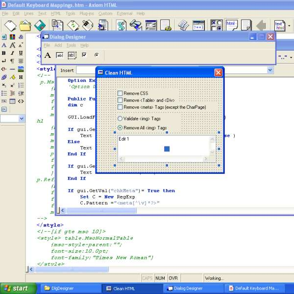



## Form Designer \- design and edit forms, add,move,resize controls, save & load forms\.\.\.

### Description

Form Designer - design and edit forms, add,move,resize controls, save & load forms...

The ControlSizer class is from <www.vbthunder.com> with minor modification, the rest is mine.

This code is part of a larger project i'm working on (called Axiom) where i use VBScript for scripting the app, and this to design forms for use with it.

I'm only using textboxes,labels,checkboxes, and option buttons, but nay control can also be added.
 
### More Info
 

             |
---                |---
**Submitted On**   |2005-01-13 22:01:20
**By**             |[M\. J\. Highlander](https://github.com/Planet-Source-Code/PSCIndex/blob/master/ByAuthor/m-j-highlander.md)
**Level**          |Intermediate
**User Rating**    |4.9 (44 globes from 9 users)
**Compatibility**  |VB 6\.0
**Category**       |[Complete Applications](https://github.com/Planet-Source-Code/PSCIndex/blob/master/ByCategory/complete-applications__1-27.md)
**World**          |[Visual Basic](https://github.com/Planet-Source-Code/PSCIndex/blob/master/ByWorld/visual-basic.md)
**Archive File**   |[Form\_Desig1839611132005\.zip](https://github.com/Planet-Source-Code/m-j-highlander-form-designer-design-and-edit-forms-add-move-resize-controls-save-load-form__1-58268/archive/master.zip)

